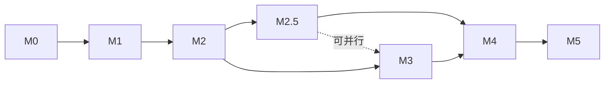

# AgentCall 任务拆解 — 里程碑与任务卡

> 版本：v1.0（2026-07-07），配套 `docs/01-requirements.md`
> 评审：codex 三轮评审 PASS with notes（`.codex_dialog.md`）
> 工作量单位：S ≈ 半天内，M ≈ 1-2 天，L ≈ 3-5 天（均为估计，随 Spike 结论校准）

## 0. 里程碑总览

| 里程碑 | 目标 | 退出条件 |
|--------|------|----------|
| **M0 项目底座** | AA 迁入正式仓库，现有能力回归 | qwen 链路真机来电接听回归通过；pytest 骨架跑绿；USB 桥可自动拉起与恢复 |
| **M1 技术 Spike** | 三大技术风险出结论 | S1/S2/S3 报告落 docs/，D3/D7/D8 决策被数据确认或修订 |
| **M2 LocalPipelineAgent v1** | 本地大脑整句版真机通话 | `AGENT_PROVIDER=local` 真机 5 轮对话，speech_end→首帧 < 4s，主循环无阻塞 |
| **M2.5 流式降延迟** | 句级流水线 | speech_end→首帧 p95 < 2.5s（S3 校准后确认目标） |
| **M3 工具与基建** | 工具调用 + 工程化能力对齐 poc | 三工具真机各验 1 次且 policy 生效；预热进度/keepalive/call_log/config 面板可用 |
| **M4 体验增强** | barge-in、DTMF、音质 | 依 S2 结论交付 barge-in 或书面放弃理由；DTMF 真机验证 |
| **M5 收尾** | 测试、验收、文档 | 真机验收清单全过；部署文档可让新人复现环境 |

**关键依赖链**：M0 → M1 → M2 → M2.5 → M3 → M4 → M5（M2.5 可与 M3 部分并行；T3.3-T3.6 不依赖工具链路，可提前插队）。

---

## M0 项目底座

### T0.1 仓库初始化与 AA 迁入 [M]
- **Scope**：`git init`；AA 全量拷入并重组为 `src/agentcall/` 包结构（modem/audio_bridge/call_agent/events/web/agents）；修 import 路径；`pyproject.toml`；`.gitignore`（data/、.env、模型缓存）；`.env.example`；README（含 Mac 上 USB 桥 + app 双进程启动步骤）。
- **不许碰**：不改任何业务逻辑，纯搬迁+重组（重组本身要单独 commit，便于 diff 审查）。
- **Validation**：`python app.py` 启动无 import 错误；web 打开正常；`git log` 迁移与重组分 commit。

### T0.2 EC20 USB→PTY 桥生命周期管理 [M]
- **Scope**：`scripts/ec20_usb_pty.py` 增强：进程唯一锁（防双开抢 USB claim）、stale symlink/claim 清理、模组重插自动重连、退出清理、结构化日志；提供 `scripts/bridge.sh start|stop|status` 或由 app 启动时自动拉起（Mac）。Windows/Linux 原生串口路径直连不走桥（配置分支预留）。
- **背景**：codex 评审指出这是验收被环境问题反复打断的头号来源。
- **Validation**：拔插 EC20 一次后无需手工干预即恢复；双开第二实例被拒绝并有清晰报错；`/tmp/ec20-at` 在桥重启后仍可被 app 使用。

### T0.3 pytest 骨架 + 测试夹具 [M]
- **Scope**：`tests/fakes/`：`FakeModem`（可注入 RING/CLCC/CMTI 序列、记录 ATA/ATH/CMGS）、`FakeAudioBridge`（内存 PCM 环回）、`FakeAgent`（回声/脚本化回复）。首批单测：RING→ATA 去重、CLCC 重复上报、外呼 45s 超时、挂断收尾（ATH+QPCMV=0）、SMS UCS2/PDU 解码。
- **不许碰**：不为了可测性大改被测代码；必要的注入点重构最小化并单独 commit。
- **Validation**：`pytest` 全绿；夹具能在无硬件的 CI 环境跑。

### T0.4 qwen 链路真机回归 [S]
- **Scope**：真机来电→自动 ATA→qwen 对话→挂断，全流程 3 次；记录回归清单到 `docs/regression-m0.md`。
- **Validation**：3/3 成功；web 转写与事件正常；作为后续所有改动的回归基线。

---

## M1 技术 Spike（真机，每个产出报告到 `docs/spikes/`）

### T1.1 S1 音频质量与 STT 实测 [L]
- **Scope**：
  1. 采集 modem 8k 上行真实录音样本集（≥20 句，含近端/远端、安静/嘈杂）落 `data/samples/`；
  2. Silero VAD 8k 直跑 vs 16k 上采样后跑：endpoint 准确率对比；
  3. FunASR：paraformer-zh（16k 上采样喂入）vs 8k 电话模型（若 ModelScope 有可用版本）识别率（CER）对比；
  4. 重采样质量：AA 线性插值（`audio_bridge.py:39`）vs `scipy.signal.resample_poly` vs `soxr`，对 CER 的影响。
- **Validation**：`docs/spikes/s1-audio-stt.md` 含数据表 + 结论（D3 确认或修订：VAD 采样率、STT 模型、重采样实现三选择落定）。

### T1.2 S2 回声与半双工实测 [M]
- **Scope**：
  1. AI 播放期间录上行，测回声强度（能量比/相关性）；
  2. 验证 D7：UAC 模式 `pending_output_bytes()` 恒 0 导致的 speaking 判定尾音缺口，实测播放尾音被回采的时长；
  3. 标定半双工 hangover 参数（现硬编码 0.5s）；
  4. 结论：barge-in 三选一路线——裸 VAD 可行 / 需能量门限 / 需 AEC（或放弃）。
- **Validation**：`docs/spikes/s2-echo-halfduplex.md` 含录音证据 + 参数建议 + barge-in 路线结论（喂给 T4.1）。

### T1.3 S3 端到端延迟预算 [M]
- **Scope**：在 Mac+USB 桥+真机链路上分环节打点：speech_end→VAD 判定→STT→LLM 首 token/完整→TTS 首块→modem 首次写入→（估算）对端可闻。冷启动 vs 热启动各 ≥10 轮，报 p50/p95/抖动。可先用 poc 模块在桥上直测（不等 M2 完工，用最小脚本）。
- **Validation**：`docs/spikes/s3-latency.md` 延迟预算表；确认/修订 NFR-1 的 2.5s 目标；识别最大瓶颈环节供 M2.5 聚焦。

---

## M2 LocalPipelineAgent v1（整句版）

### T2.1 模型资产安装脚本 [S]（M2 其余任务的前置）
- **Scope**：`scripts/install_models.py`：下载 FunASR paraformer-zh + ct-punc-c、sherpa vits-piper-zh_CN-chaowen、silero-vad；统一缓存目录（HF_HOME/MODELSCOPE_CACHE 项目内）；校验与断点续传；安装后预热自检（各模型跑一次 dummy 推理）；失败给出可操作提示。
- **Validation**：全新环境一条命令装完并自检通过；重复执行幂等。

### T2.2 vendor 迁移四模块 [M]
- **Scope**：从 poc 拷入 `src/agentcall/agents/local/`：`vad.py`、`stt.py`（原 stt_local.py）、`tts.py`、`llm_client.py`（原 openai_client.py **精简**：只留 generate_phone_agent_reply/超时/fallback/provider 切换，删 Mac 与 inbound 分类逻辑）、`prompts.py`（原 outbound_agent.py 的 persona 与收束判定）。每个文件头注明来源 commit。剥净对 hot_daemon/auto_answer/audio_devices 的 import。
- **不许碰**：poc 原仓库只读；不搬 hot_daemon 的播放/设备注入/afplay 逻辑。
- **Validation**：`python -c "from agentcall.agents.local import vad, stt, tts, llm_client"` 通过；无 Mac 专属 import；四模块各配最小单测（dummy 输入出结构化输出）。

### T2.3 TTS PCM adapter [M]
- **Scope**：`tts_adapter.py`：文本→（切句）→sherpa 合成内存 samples→int16 PCM→24k→8k 重采样（用 S1 选定实现）→按 20ms 倍数 chunk 输出迭代器；音量规范化（poc 的 -18 dBFS 逻辑保留）。sherpa `synthesize_chunks_to_wavs` 若不便内存化则允许临时文件但不落 data/。
- **Validation**：单测：给定文本输出 PCM 长度/采样率/幅值断言；真机前用 FakeBridge 环回听感抽查（存 1 个样本 wav 供人工核对）。

### T2.4 LocalPipelineAgent 非阻塞状态机 [L]（本项目最核心任务）
- **Scope**：`pipeline_agent.py` 实现 `VoiceAgent` 接口：
  - `send_audio(pcm)`：**只**喂 VAD + speech_end utterance 入队，任何路径不得阻塞 >50ms（NFR-3）；
  - 后台 worker：取队列→**drain 合并积压 utterance**（D4 coalescing：LLM 请求发出前合并，发出后到达的排下轮）→STT→LLM→TTS adapter→PCM 推 `on_audio_out`；
  - 内部状态机 listening/processing/speaking/stopping；speech_end 去重；`stop()` 时 cancel worker + flush 队列 + 关闭模型引用；
  - 失败兜底：STT 空结果静默跳过；LLM 超时/异常播 fallback 话术（沿用 poc 预算 2s/6s/8s）；TTS 失败跳句并记日志；
  - v1 无工具：prompts 明确告知模型「不能发短信/查验证码，只能口头沟通」，禁止口头承诺执行操作（codex note）；
  - 对话历史管理（max_turns 截断，沿用 poc DialogueTurn）。
- **不许碰**：`call_agent.py` 主循环协议（send_audio/on_audio_out 语义）不改；qwen/doubao agent 不动。
- **Validation**：单测（FakeBridge+mock STT/LLM/TTS）：主循环 tick 延迟断言 <50ms、coalescing 行为、stop 中断、异常兜底；集成测：Fake 全链路一轮对话。

### T2.5 factory 注册与配置 [S]
- **Scope**：`factory.py` 加 `local`；`.env` 新增 `DEEPSEEK_API_KEY`、`LOCAL_STT_MODEL`、`LOCAL_TTS_*`、`LOCAL_VAD_*` 等；启动时校验：key 存在、模型资产已安装（缺失则指引跑 install_models）；`app.py` 配置校验扩展到三 provider（修 AA 现状只验 qwen 的问题）。
- **Validation**：三 provider 分别启动成功；缺 key/缺模型时启动即报清晰错误。

### T2.6 UAC playback-active 时间窗修正 [S]
- **Scope**：`audio_bridge.py`：UAC 模式按累计写入字节数与 8k×2B/s 推算「预计播完时刻」，`pending_output_bytes()`/新方法 `playback_active()` 返回真实播放状态；半双工判定改用它；hangover 参数化（S2 标定值）。
- **Validation**：单测：写入 N 字节后 playback_active 的时间窗断言；真机：AI 说话尾音不再被回采触发（对照 S2 录音复测）。

### T2.7 真机整句链路验收 [S]
- **Validation（即 Scope）**：`AGENT_PROVIDER=local` 真机来电，≥5 轮对话无卡死、无串音；speech_end→首帧 < 4s（S3 打点脚本复测）；web 转写正确显示 user/agent 双向文本；记录 `docs/regression-m2.md`。

---

## M2.5 流式降延迟

### T2.8 LLM streaming 切句 [M]
- **Scope**：`llm_client.py` 支持 `stream=True`；按标点/最大长度增量切句输出（句生成器）；保留非流式路径做降级；fallback/超时逻辑适配流式（首 token 超时判定）。
- **Validation**：单测：模拟流式 chunk 断言切句边界；打点显示 LLM 首句时间 << 完整回复时间。

### T2.9 句级 TTS 流水线 [M]
- **Scope**：worker 改造：LLM 句生成器→逐句 TTS→逐句推 PCM（上一句播放期间合成下一句）；保证句序；stop/新 utterance 到达时的流水线取消语义。
- **Validation**：真机打点 speech_end→首帧 p95 < 2.5s（或 S3 修订值）；对话自然度人工抽查；`docs/regression-m25.md`。

---

## M3 工具与工程基建

### T3.1 DeepSeek function calling 工具循环 [M]
- **Scope**：`tool_loop.py`：AA 的 tool spec（send_sms/hangup_call/query_verification_code）→ OpenAI-compatible `tools` 参数；解析 `tool_calls`→dispatch 到 CallSession 注册的回调→tool 结果回填→二次请求生成口头确认；与流式切句共存（tool_calls 分支不走 TTS 直出）。
- **Validation**：单测 mock LLM 返回 tool_calls 断言 dispatch 与二次生成；真机三工具各验 1 次。

### T3.2 工具安全 policy 层 [M]
- **Scope**：`send_sms`：收件人白名单（.env 配置）+ 每通话频控（默认 ≤2 条）；`hangup`：保留 AA 的告别语延迟窗并参数化（现硬编码 4.5s）；`query_code`：默认禁用，显式配置开启；全部工具调用写 EventHub 审计事件；日志短信内容脱敏开关。
- **Validation**：单测：白名单外号码被拒且 AI 收到失败结果、频控触发、禁用工具不出现在 tools 列表；审计事件落 messages.json/events。

### T3.3 预热与 warmup 进度上报 [S]
- **Scope**：移植 poc `warm_hot_models` 思路：app 启动后台预热 VAD/STT/TTS/LLM；`warmup.py`（poc warmup_state）状态写 EventHub；web 仪表盘加进度条；预热完成前来电的策略（拒接/接后播「稍等」，配置项）。
- **Validation**：冷启动预热全程进度可见；预热中来电按配置策略处理。

### T3.4 LLM keepalive [S]
- **Scope**：移植 poc `llm_warmup.py` keepalive 线程（默认 45s ping、通话中暂停），适配 DeepSeek/local provider 生效条件。
- **Validation**：日志可见周期 ping；通话期间无 ping；空闲 1h 后来电 LLM 首响无冷启惩罚（对比打点）。

### T3.5 call_log 会话记录 [M]
- **Scope**：移植 poc call_log 思路：每通话目录 `data/recordings/<ts>/`：events.jsonl（含各环节延迟打点）+ 分轮上行 wav + TTS wav；录音开关与保留期配置；一键清除命令。
- **Validation**：真机一通电话后产物齐全可回放；关闭开关后不落盘。

### T3.6 config 面板 [S]
- **Scope**：移植 poc config_manager：web 增加配置读写 API 与页面（provider、录音开关、工具开关、半双工参数等白名单项），写回 .env 保留注释格式；改 provider 需重启的提示。
- **Validation**：面板改一项→.env 变更正确→重启生效。

---

## M4 体验增强

### T4.1 barge-in [L]（前置：S2 结论为「可行」路线之一）
- **Scope**：speaking 期间继续跑 VAD（按 S2 选定：裸 VAD/能量门限）；触发打断→清输出队列+取消 TTS 流水线+状态转 listening；打断阈值参数化防误触发。若 S2 结论为不可行，本卡改为书面记录放弃理由与未来 AEC 路线。
- **Validation**：真机：AI 长句播放中说话，1s 内 AI 停止并转听；连续 10 次误打断率 0（静默播放期）。

### T4.2 DTMF 发送 [S]
- **Scope**：modem.py 加 `AT+VTS` 封装；prompts 加 DTMF 协议（沿用 poc `DTMF_PRESS=123#` 约定）；tool 或文本协议二选一实现并说明。
- **Validation**：真机拨 IVR 热线按键导航成功 1 次。

### T4.3 开场白预合成缓存 [S]
- **Scope**：常用开场白/兜底话术启动时预合成 PCM 缓存（替代 AA 现硬编码开场白+现打 wav 文件），命中即推免合成延迟。
- **Validation**：接通→开场白首帧延迟打点对比（缓存 vs 实时合成）。

### T4.4 音频治理 [S]
- **Scope**：TX/RX 增益、削波检测告警、静音填充参数化（.env）；沿用 AA `MODEM_TX_GAIN` 并补 RX。
- **Validation**：录音样本无削波；增益调整生效可听。

---

## M5 收尾

### T5.1 测试补全 [M]
- **Scope**：状态机/adapter/policy 单测补全到核心路径全覆盖；`pytest` 一键全跑；（可选）GitHub Actions 无硬件单测 CI。
- **Validation**：pytest 全绿；覆盖率报告核心模块 >70%（数字可按实际调整，先测起来）。

### T5.2 真机验收清单 [M]
- **Scope**：执行并记录 `docs/acceptance.md`：来电自动接听×3、local 对话 5 轮×3 通、qwen 回归×1、外呼×1、中英文短信收发、验证码播报（开启时）、AI 主动挂断、30 分钟长通话稳定性、拔插恢复、冷启动预热→来电。
- **Validation**：清单全过或逐项记录偏差与 issue。

### T5.3 部署文档 [S]
- **Scope**：`docs/deploy-macos.md`：从零环境到可接电话（Python/依赖/模型/USB 桥/launchd 常驻可选）；key 管理规范（.env 不入 git、泄露轮换）；Linux 部署差异预留章节（串口直连、systemd）。
- **Validation**：按文档在干净环境走一遍可复现（或由第二人执行）。

---

## 附A：真机验收环境

- 硬件：EC20 模组 USB 直插 Mac（x86_64，Darwin 24.3）+ 实体 SIM
- 桥：`scripts/ec20_usb_pty.py --map 2:/tmp/ec20-at --map 3:/tmp/ec20-pcm`
- 音频：UAC 模式优先（`MODEM_AUDIO_MODE=uac`），NMEA 作为 S1 对比项

## 附B：codex 评审结论摘要（3 轮，全文见 `.codex_dialog.md`）

- **P1 已吸收进设计**：send_audio 非阻塞（T2.4）、内部状态机（T2.4）、TTS PCM adapter（T2.3）、工具循环从零实现（T3.1）
- **P2 已吸收**：poc 模块精确取舍清单（T2.2）、S1 扩展 VAD/重采样（T1.1）、思考期 coalescing 语义（T2.4）、USB 桥生命周期进 M0（T0.2）
- **遗漏项已补**：夹具先行（T0.3）、工具安全（T3.2）、DTMF AT 路线（T4.2）、模型资产安装（T2.1）、音频治理（T4.4）、录音隐私（T3.5/NFR-5）
- **最终 verdict**：PASS with notes——重点盯 UAC 半双工判定（T2.6）与 utterance 合并边界（T2.4）
